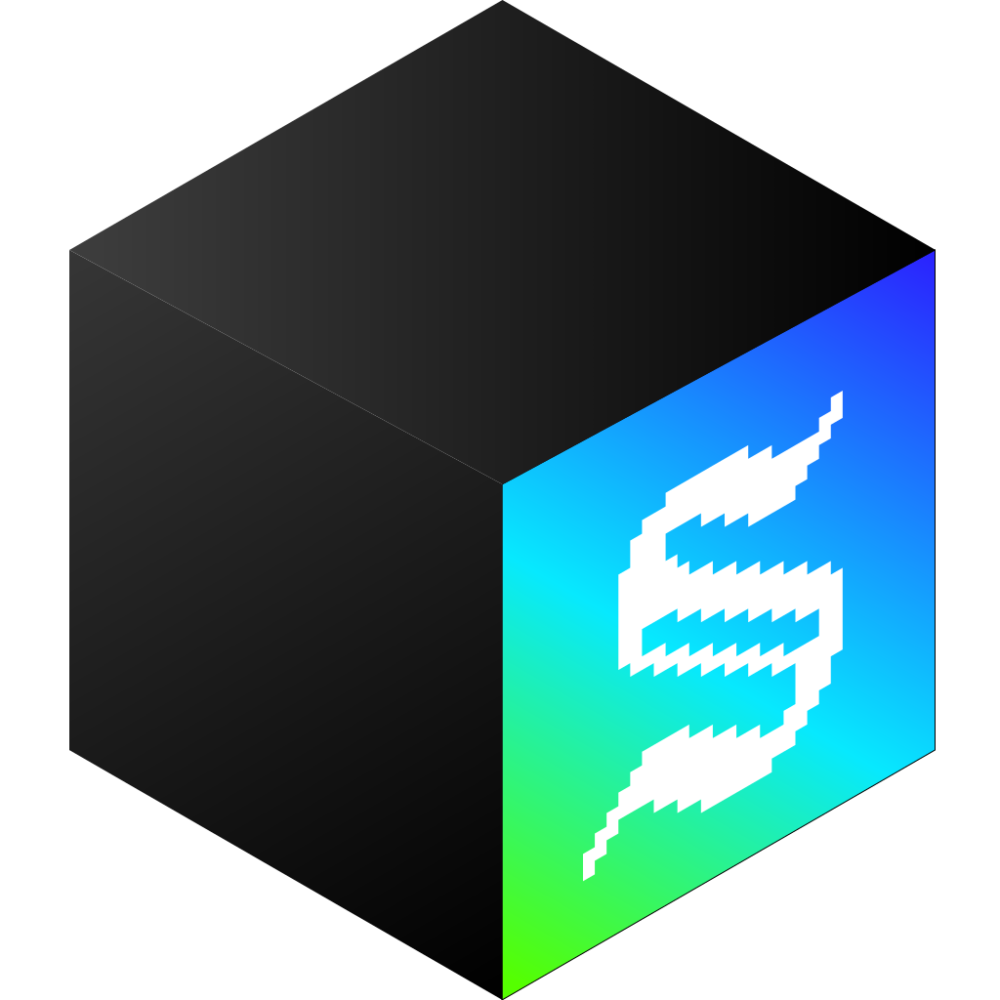

<div align="center">
  <br>
  

# Asvgard

**A high-performance graphics engine built from scratch in Rust.**

[](https://www.rust-lang.org/)
[](LICENSE)
[]()

<sub>Systems Programming • Algorithms • Computer Graphics</sub>
</div>

<br>

## 👨‍💻 About The Project

**Asvgard** is a deep-dive into the low-level mechanics of computer graphics and file compression. 

The goal of this project was simple but challenging: **render images without using *any* external image processing libraries.**

Instead of relying on `image-rs` or `flate2`, I implemented every layer of the stack manually. From decoding the variable-length bitstreams of a PNG's Zlib layer to rasterizing Bezier curves for SVGs, this project demonstrates a comprehensive understanding of binary file parsing, memory management, and algorithm implementation.

## 🚀 Technical Highlights

### 📦 Custom DEFLATE & PNG Engine
Implemented a fully RFC 1951 compliant decompression engine from zero.
*   **Bit-Level Parsing**: Wrote a custom `BitReader` with a 64-bit accumulator for efficient LSB-first stream consumption.
*   **Canonical Huffman Decoding**: Implemented dynamic tree reconstruction (using code lengths) and a loop-based decoding strategy for symbol resolution.
*   **LZ77 Decompression**: Handled sliding window history buffers to reconstruct repeated data patterns.
*   **Inverse Filtering**: Implemented the complete PNG filtering pipeline (Paeth, Sub, Up, Average) to reconstruct raw pixel data from filtered scanlines.

### 🎨 Vector Rasterization (SVG)
Built a rendering engine capable of translating mathematical path descriptions into pixels.
*   **XML Parsing**: Custom tokenizer for parsing SVG tag structures.
*   **Path Tesselation**: Algorithms to flatten mathematical curves (Cubic/Quadratic Beziers) into renderable line segments.
*   **Transform Pipeline**: Implemented matrix transformations to handle `viewBox` scaling and coordinate mapping.

### 🖼️ Image Processing
*   **Bilinear Interpolation**: Implemented a high-quality resampling algorithm from scratch for smooth image scaling.
*   **Format Detection**: Heuristic-based detection to automatically identify and dispatch parsers for PNG, TGA, and SVG formats.

---

## 🛠️ Supported Formats

| Format | Implementation Details | Status |
| :--- | :--- | :---: |
| **PNG** | **Full RFC 1951 Deflate** (Huffman/LZ77), Standard & Indexed Color, Inverse Filtering. | ✅ |
| **SVG** | Path parsing (M/L/C/Q/A), Stroke/Fill logic, Coordinate system transforms. | ✅ |
| **TGA** | Uncompressed RGB/RGBA, Run-Length Encoding (RLE) compression. | ✅ |

---

## 💻 Usage

This library exposes a unified `load_image` API that abstracts away the complexity of different file formats.

```rust
use asvgard::prelude::*;

fn main() {
    // 1. Raw bytes from any source
    let data = include_bytes!("assets/test.png");
    
    // 2. Target dimensions (The engine handles resampling)
    let width = 800;
    let height = 600;

    // 3. Load & Rasterize
    // Returns a raw Vec<u32> buffer (ARGB) ready for the GPU or windowing system
    match load_image(data, width, height) {
        Ok(buffer) => println!("Rendered {} pixels in memory.", buffer.len()),
        Err(e) => eprintln!("Pipeline Error: {}", e),
    }
}
```

## 📂 Architecture

The codebase is organized to cleanly separate binary parsing from rendering logic.

```
src/
├── png/             # PNG & Zlib Implementation
│   ├── zlib.rs      # The DEFLATE engine (BitReader, HuffmanTree, Inflate)
│   ├── filter.rs    # Signal processing (Unfiltering scanlines)
│   └── chunks.rs    # Binary chunk structure definitions
├── svg/             # Vector Graphics Engine
├── tga/             # TGA Parser & RLE Decoder
└── utils/           # Shared Algorithms (Bilinear Resizing, Math)
```

## 🔮 Future Improvements

*   **SIMD Optimizations**: Porting the Huffman decoder to use SIMD instructions for faster table lookups.
*   **SIMD Optimizations**: Porting the Huffman decoder to use SIMD instructions for faster table lookups.
*   **Multi-threading**: Parallelizing the unfilter loop for large PNGs.

## 📄 License

This project is open-source and available under the [MIT License](LICENSE).